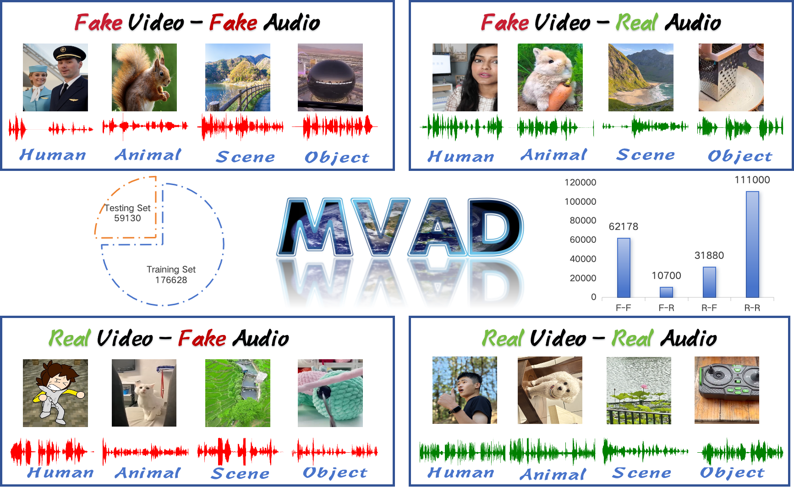
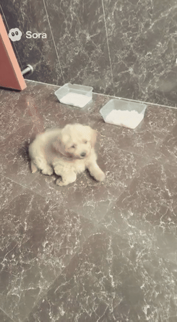
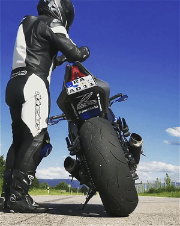
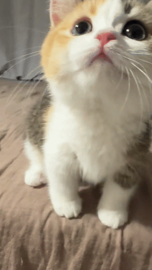

# MVAD
MVAD is the first general-purpose dataset specifically designed for detecting AI-generated multimodal video-audio content.

## :file_folder: Dataset Overview
### Statistics of  multimodal video-audio data in the MVAD dataset:
Reflecting the diversity of multimodal video-audio content in real-world scenarios, MVAD spans two visual domains (realistic and anime-style) and covers four primary categories: humans, animals, objects, and scenes. The dataset incorporates three video-audio forgery types and four modality combinations (fake-fake, fake-real, real-fake, real-real). As shown in Table, MVAD contains 205,758 multimodal video-audio samples generated using over 20 distinct methods, including 104,578 forged and 101,000 authentic samples. Following conventional dataset design principles , MVAD maintains a 1:1 ratio between forged and authentic samples. The distribution across modality combinations is as follows: fake-fake (62,178 samples), real-fake (31,880), fake-real (10,700), and real-real (101,000).
| Video Source | Modality | Audio Generate | Length | Train | Test | Count | Total Count |
|-------------|----------|---------------|--------|-------|------|-------|-------------|
| Ugc-VideoCaptioner | R-R | - | 10-60s | - | 1,000 |  |  |
| HarmonySet | R-R | - | 10-60s | - | 30,000 | 31,000 |  |
| TalkVid | R-R | - | 3s | 80,000 | - | 80,000 | 111,000 |
| Msvd | R-F | FC&HY&MMA&AX | 1-10s | - | 7,880 |  |  |
| OpenVid-1M | R-F | FC&HY&MMA&AX | 1-10s | - | 8,000 | 15,880 |  |
| InternVid-10M | R-F | FC&HY&MMA&AX | 1-10s | 8,000 | - |  |  |
| MSR-VTT | R-F | FC&HY&MMA&AX | 1-10s | 8,000 | - | 16,000 | 31,880 |
| Sora | R-F | FC&HY&MMA&AX | 10-30s | - | 224 |  |  |
| Viva | F-F | FC&HY&MMA&AX | 2-5s | - | 3,980 |  |  |
| Vidu | F-F | FC&HY&MMA&AX | 3s | - | 2,908 |  |  |
| JiMeng | F-F | FC&HY&MMA&AX | 3s | - | 2,480 |  |  |
| Kling2.1 | F-F | - | 5s/10s | - | 513 |  |  |
| Kling2.5Turbo | F-F | - | 5s/10s | - | 249 |  |  |
| Sora2 | F-F | - | 10s | - | 996 |  |  |
| Voe3 | F-F | - | 8s-60s | - | 200 | 11,550 |  |
| MoonValley | F-F | FC&HY&MMA&AX | 4s | 11,508 | - |  |  |
| pika | F-F | FC&HY&MMA&AX | 3s | 13,128 | - |  |  |
| Haiper | F-F | FC&HY&MMA&AX | 2s | 5,584 | - |  |  |
| Noisee | F-F | FC&HY&MMA&AX | 4s | 5,184 | - |  |  |
| Pixverse | F-F | FC&HY&MMA&AX | 4s | 8,628 | - |  |  |
| Emu3 | F-F | FC&HY&MMA&AX | 4s | 3,600 | - |  |  |
| Gen3 | F-F | FC&HY&MMA&AX | 10s | 2,668 | - |  |  |
| Kling1.6 | F-F | - | 5s/10s | 328 | - | 50,628 | 62,178 |
| Wan2.1 | F-R | - | 3s | - | 500 | 700 |  |
| Kling-Avata | F-R | - | 3s | - | 200 | 700 |  |
| Humo | F-R | - | 3s | 10,000 | - | 10,000 | 10,700 |
| **Total Count** | - | - | - | 176,628 | 59,130 |  | 215,758 |
### MVAD Dataset Download
Our dataset will be released soon.
### Demos of four multimodal video-audio data types
#### Fake Video - Fake Audio

[demo_animal](https://github.com/HuMengXue0104/MVAD/blob/main/demos/Fake_Fake/fake_fake_animal.mp4)

[demo_scene](https://github.com/HuMengXue0104/MVAD/blob/main/demos/Fake_Fake/fake_fake_scene.mp4)

[demo_object](https://github.com/HuMengXue0104/MVAD/blob/main/demos/Fake_Fake/fake_fake_object.mp4)

[demo_human](https://github.com/HuMengXue0104/MVAD/blob/main/demos/Fake_Fake/fake_fake_human.mp4)
#### Real Video - Fake Audio

[demo_scene](https://github.com/HuMengXue0104/MVAD/blob/main/demos/Real_Fake/real_fake_scene.mp4)

[demo_human](https://github.com/HuMengXue0104/MVAD/blob/main/demos/Real_Fake/real_fake_human.mp4)
#### Fake Video - Real Audio

[demo_animal](https://github.com/HuMengXue0104/MVAD/blob/main/demos/Fake_Real/fake_real_animal.mp4)

[demo_scene](https://github.com/HuMengXue0104/MVAD/blob/main/demos/Fake_Real/fake_real_scene.mp4)

[demo_object](https://github.com/HuMengXue0104/MVAD/blob/main/demos/Fake_Real/fake_real_object.mp4)

[demo_human](https://github.com/HuMengXue0104/MVAD/blob/main/demos/Fake_Real/fake_real_human.mp4)
#### Real Video - Real Audio

[demo_animal](https://github.com/HuMengXue0104/MVAD/blob/main/demos/Real_Real/real_real_animal.mp4)

[demo_human](https://github.com/HuMengXue0104/MVAD/blob/main/demos/Real_Real/real_real_human.mp4)
