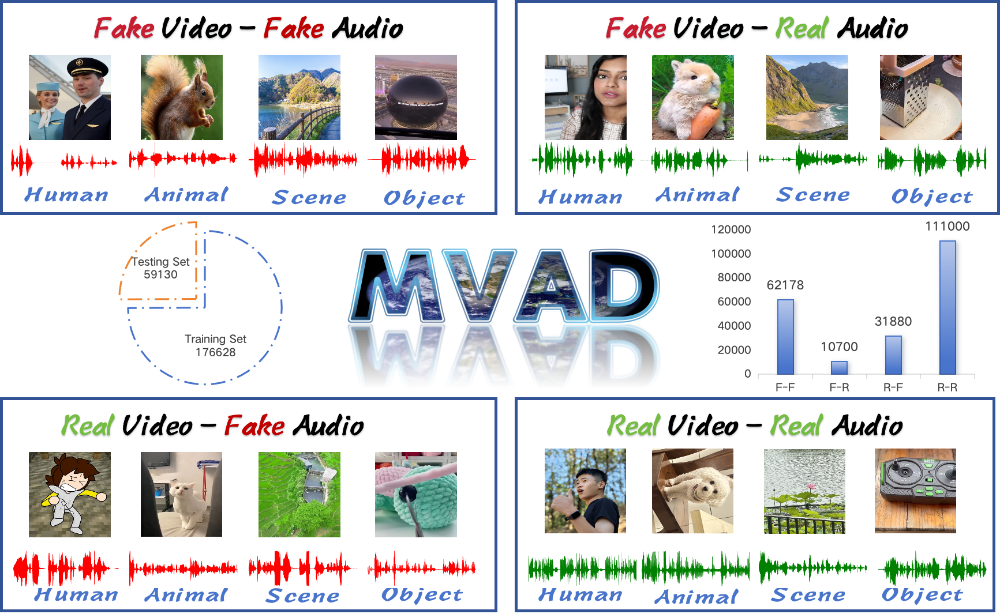
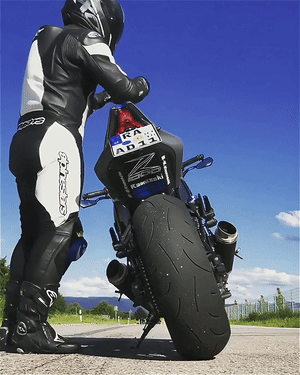
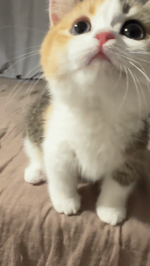

#MVAD: A Benchmark Dataset for Multimodal AI-Generated Video-Audio
Detection
MVAD is the first general-purpose dataset specifically designed for detecting AI-generated multimodal video-audio

## MVAD Dataset Download
The version issue has been resolved, so everyone can use it. The training set has been uploaded, and the test set is still being uploaded.
## :file_folder: Dataset Overview
### Statistics of  multimodal video-audio data in the MVAD dataset:
Reflecting the diversity of multimodal video-audio content in real-world scenarios, MVAD spans two visual domains (realistic and anime-style) and covers four primary categories: humans, animals, objects, and scenes. The dataset incorporates three video-audio forgery types and four modality combinations (fake-fake, fake-real, real-fake, real-real). As shown in Table, MVAD contains 205,758 multimodal video-audio samples generated using over 20 distinct methods, including  forged and 101,000 authentic samples. Following conventional dataset design principles , MVAD maintains a 1:1 ratio between forged and authentic samples. The distribution across modality combinations is as follows: fake-fake (62,178 samples), real-fake (31,880), fake-real (10,700), and real-real (101,000).
| Video Source       | Modality | Audio Generate       | Length   | Train | Test  | Count | Total Count |
|--------------------|----------|----------------------|----------|-------|-------|-------|-------------|
| HarmonySet         | R-R      | -                    | 10-60s   | 30000 | -     |       |             |
| TalkVid            | R-R      | -                    | 3s       | 20000 | -     | 50000 |             |
| OpenVid-1M         | R-F      | FC&HY&MMA&AX         | 1-10s    | 8000  | -     |       |             |
| InternVid-10M      | R-F      | FC&HY&MMA&AX         | 1-10s    | 8000  | -     | 24000 |             |
| MSR-VTT            | R-F      | FC&HY&MMA&AX         | 1-10s    | 8000  | -     |       |             |
| JiMeng             | F-F      | FC&HY&MMA&AX         | 5-10s    | 4764  | -     |       |             |
| KlingO1            | F-F      | FC&HY&MMA&AX         | 4s       | 4400  | -     |       |             |
| Sora2              | F-F      | -                    | 5-10s    | 5000  | -     | 17200 |             |
| Kling2.1           | F-F      | -                    | 5-10s    | 513   | -     |       |             |
| Kling1.6           | F-F      | -                    | 5-10s    | 324   | -     |       |             |
| Kling2.6           | F-F      | -                    | 5-10s    | 1902  | -     |       |             |
| kling2.5Turbo      | F-F      | -                    | 5-10s    | 297   | -     |       |             |
| Humo               | F-R      | -                    | 3s       | 8800  | -     |  8800 |             |

#### modelscope
https://modelscope.cn/datasets/MengxueBoBo/MVAD
#### huggingface
https://huggingface.co/datasets/mengxuebobo/MVAD
### Demos of four multimodal video-audio data types
#### Fake Video - Fake Audio

[demo_animal](https://github.com/HuMengXue0104/MVAD/blob/main/demos/Fake_Fake/fake_fake_animal.mp4)

[demo_scene](https://github.com/HuMengXue0104/MVAD/blob/main/demos/Fake_Fake/fake_fake_scene.mp4)

[demo_object](https://github.com/HuMengXue0104/MVAD/blob/main/demos/Fake_Fake/fake_fake_object.mp4)

[demo_human](https://github.com/HuMengXue0104/MVAD/blob/main/demos/Fake_Fake/fake_fake_human.mp4)
#### Real Video - Fake Audio

[demo_scene](https://github.com/HuMengXue0104/MVAD/blob/main/demos/Real_Fake/real_fake_scene.mp4)

[demo_human](https://github.com/HuMengXue0104/MVAD/blob/main/demos/Real_Fake/real_fake_human.mp4)
#### Fake Video - Real Audio

[demo_animal](https://github.com/HuMengXue0104/MVAD/blob/main/demos/Fake_Real/fake_real_animal.mp4)

[demo_scene](https://github.com/HuMengXue0104/MVAD/blob/main/demos/Fake_Real/fake_real_scene.mp4)

[demo_object](https://github.com/HuMengXue0104/MVAD/blob/main/demos/Fake_Real/fake_real_object.mp4)

[demo_human](https://github.com/HuMengXue0104/MVAD/blob/main/demos/Fake_Real/fake_real_human.mp4)
#### Real Video - Real Audio

[demo_animal](https://github.com/HuMengXue0104/MVAD/blob/main/demos/Real_Real/real_real_animal.mp4)

[demo_human](https://github.com/HuMengXue0104/MVAD/blob/main/demos/Real_Real/real_real_human.mp4)
